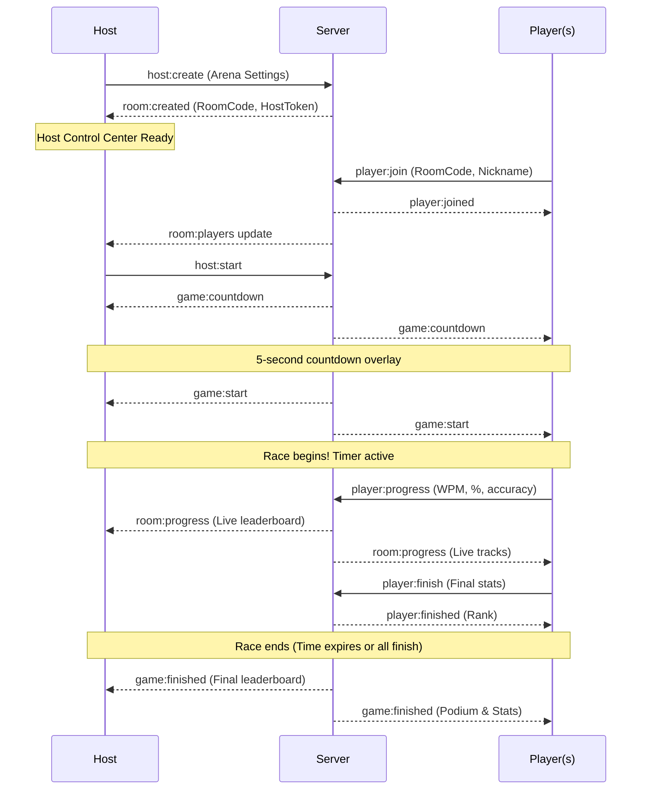

# ⚔️ TypingArena — Multiplayer Real-Time Typing Battle Platform

A competitive, host-controlled real-time typing battle platform built for live events, meetups, corporate competitions, and typing tournaments. Up to 60 players connect simultaneously via WebSockets, racing across real-time tracks with live WPM/progress broadcasts and host orchestration.

---

## 🚀 Key Features & Product Differentiators

- **👑 Host-Controlled Arena Events**:
  - Full room management: max players (up to 60), min players to start, custom duration (15s – 120s), countdown timers (3s – 10s).
  - Mode selection (Standard, Elimination, Sudden Death) and text difficulty (Easy, Medium, Hard).
  - Live controls: **Start Race**, **Pause**, **Resume**, **Reset / Play Again**, **Stop Race**, and **End Arena**.
  - Host moderation: Kick misbehaving players, copy invite links / room codes.
  - Spectator / Host view mode with live broadcast status.

- **⚡ Real-Time Multiplayer Engine (Socket.IO)**:
  - Sub-50ms latency updates broadcast to all room participants.
  - Live race tracks showing every racer's avatar, live WPM, and progress percentage.
  - In-memory room store with automatic heartbeat, cleanup, and reconnect resilience.

- **🎯 Precision Typing Engine**:
  - Accurate character-by-character validation with real-time green/red visual feedback.
  - Active cursor with smooth pulsing indicator and backspace navigation.
  - Live calculated metrics: net WPM (5 chars = 1 word), accuracy %, correct chars, errors.
  - Instant finish detection with podium rankings and celebration effects.

- **🏆 Dynamic Podium & Leaderboard**:
  - Animated 1st, 2nd, and 3rd place podium with gold, silver, and bronze highlights.
  - Real-time sorted standings table with WPM and accuracy metrics.
  - Personal performance breakdown (WPM, Accuracy %, Correct Characters, Total Errors, Final Rank).

- **🎨 Modern Cyberpunk / Dark Tournament Aesthetic**:
  - Dark mode with tailored violet/cyan neon glow palettes (`#060610` background, `#7c3aed` and `#06b6d4` accents).
  - Glassmorphic panels, animated gradient borders, and responsive grid patterns.
  - Micro-animations: countdown scaling, live dot pulses, podium slide-ins.

---

## 🛠️ Architecture & Tech Stack

```
TypingArena/
├── client/                 # React 18 + Vite + TypeScript Frontend
│   ├── src/
│   │   ├── components/     # Countdown, Timer, TypingEngine, Leaderboard, etc.
│   │   ├── contexts/       # Toast notification system
│   │   ├── lib/            # Socket singleton, typing math, helpers
│   │   ├── pages/          # Landing, CreateArena, JoinArena, HostLobby, PlayerLobby, GamePage, ResultsPage
│   │   ├── types.ts        # TypeScript contract definitions
│   │   └── index.css       # Design tokens, cyber animations, glassmorphism
│   └── vite.config.ts      # Vite bundler configuration & proxy
│
└── server/                 # Node.js + Express + Socket.IO Backend
    ├── src/
    │   ├── socket/         # Event handlers for room management & gameplay
    │   ├── rooms.ts        # In-memory arena store, state transitions & timers
    │   ├── texts.ts        # Curated typing passages categorized by difficulty
    │   ├── types.ts        # Shared data contracts
    │   └── index.ts        # Server entry point & CORS configuration
```

---

## 🏁 Quickstart

### Prerequisites
- Node.js 18+
- npm 9+

### 1. Install Dependencies
```bash
# Install root, server, and client dependencies
npm run install:all
```

Or individually:
```bash
npm install
npm --prefix server install
npm --prefix client install
```

### 2. Run Both Server & Client Concurrently
```bash
npm run dev
```

- **Client App**: [http://localhost:5173](http://localhost:5173)
- **Backend API & Socket.IO**: [http://localhost:3001](http://localhost:3001)

---

## 🎮 Game Flow



---

## 🔌 Socket.IO API Events

### Client to Server
| Event | Payload | Description |
|---|---|---|
| `room:create` | `{ name, settings, hostNickname }` | Create a new arena room |
| `room:join` | `{ roomCode, nickname }` | Join an existing room as a player |
| `host:start` | `{ roomCode, hostToken }` | Trigger race countdown |
| `host:pause` | `{ roomCode, hostToken }` | Pause the active race |
| `host:resume` | `{ roomCode, hostToken }` | Resume the paused race |
| `host:stop` | `{ roomCode, hostToken }` | Stop race early and finalize scores |
| `host:restart` | `{ roomCode, hostToken }` | Reset arena for another round |
| `host:kick` | `{ roomCode, hostToken, playerId }` | Kick a player from the arena |
| `host:end` | `{ roomCode, hostToken }` | Terminate and destroy room |
| `player:progress` | `{ roomCode, playerId, progress, wpm, accuracy, correctChars, incorrectChars }` | Broadcast typing stream |
| `player:finish` | `{ roomCode, playerId, wpm, accuracy, correctChars, incorrectChars }` | Mark racer as completed |
| `reconnect:host` | `{ roomCode, hostToken }` | Reconnect host to active room |
| `reconnect:player` | `{ roomCode, playerId }` | Reconnect player to active room |

### Server to Client
| Event | Payload | Description |
|---|---|---|
| `room:state` | `RoomPublic` | Full snapshot of arena state |
| `room:players` | `PlayerPublic[]` | Updated player list |
| `room:progress` | `PlayerPublic[]` | Real-time race progress broadcast |
| `game:countdown` | `{ countdownTarget, duration }` | Start countdown overlay |
| `game:start` | `{ startTime, endTime, text }` | Begin typing race |
| `game:paused` | `{ pausedAt, remainingTime }` | Race paused |
| `game:resumed` | `{ endTime }` | Race resumed |
| `game:stopped` | `{}` | Race stopped early |
| `game:finished` | `{ players }` | Race concluded, podium ready |
| `player:kicked` | `{ reason }` | Player was removed by host |
| `room:ended` | `{ reason }` | Host closed the room |

---

## 🧪 Testing and Verification
- **Frontend Typecheck & Build**: `npm run build --prefix client`
- **Backend Typecheck**: `npx tsc --noEmit --prefix server`
- **Production Bundle**: Validated with Vite and LightningCSS

---

## 📜 License
MIT License. Built for tournament-level multiplayer typing experiences.
